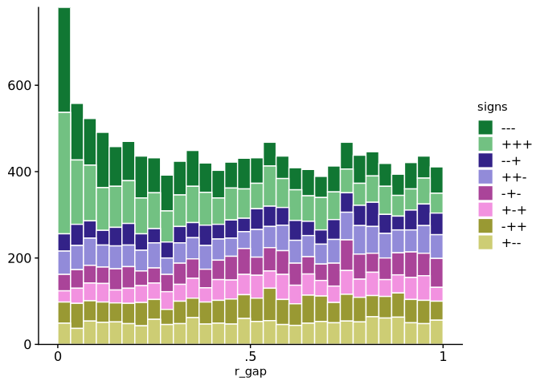

<!-- README.md is generated from README.Rmd. Please edit that file -->

# Rank-gap statistics for exploring high-dimensional overlap

<!-- badges: start -->
<!-- badges: end -->

This package contains functions for computing rank-gap and related
statistics, and plotting the results. These statistics provide a
convenient way to represent greater-than-expected concordance among
items ranked highly across all of number of lists.

Rank-gap statistics were developed to understand “overlap” and in
genomics and high throughput biology, but may be useful for exploring
multivariate distributions in other contexts.

## Example

We illustrate the package using data from a comparison of (disease vs.
wild-type) gene expression differences in mice with three relate genetic
diseases (Mendelian Disorders of the Epigenetic Machinery, or MDEMs).
The data are from (Luperchio et. al., 2021); `d_B_limma` contains output
from a limma reanalysis of the raw read counts.

Importantly, diseased mice were compared with littermate controls, so we
expect technical errors across the three (disease vs. wilde-type)
comparisons to be independent.

``` r
library(rankGap)
library(tibble)

tibble(d_B_limma)
#> # A tibble: 13,474 × 25
#>    ensembl_id      logFC.KS1 AveExpr.KS1  t.KS1 P.Value.KS1 adj.P.Val.KS1  B.KS1
#>    <chr>               <dbl>       <dbl>  <dbl>       <dbl>         <dbl>  <dbl>
#>  1 ENSMUSG0000000…    0.0535       6.96   0.878     0.402           0.772 -6.92 
#>  2 ENSMUSG0000000…    0.221        1.35   1.08      0.306           0.711 -5.50 
#>  3 ENSMUSG0000000…    0.176        5.98   1.40      0.195           0.633 -6.25 
#>  4 ENSMUSG0000000…    0.759       -1.08   1.85      0.0966          0.533 -4.19 
#>  5 ENSMUSG0000000…   -0.428        9.18  -1.63      0.152           0.594 -6.12 
#>  6 ENSMUSG0000000…    0.105        4.98   1.41      0.192           0.629 -6.05 
#>  7 ENSMUSG0000000…   -0.140        5.23  -1.45      0.180           0.618 -6.03 
#>  8 ENSMUSG0000000…    0.327       -0.565  0.834     0.425           0.783 -5.25 
#>  9 ENSMUSG0000000…    0.547        3.42   4.49      0.00135         0.135 -0.893
#> 10 ENSMUSG0000000…   -0.395       -0.806 -0.823     0.431           0.786 -5.15 
#> # ℹ 13,464 more rows
#> # ℹ 18 more variables: se.KS1 <dbl>, se_unshrunk.KS1 <dbl>, logFC.KS2 <dbl>,
#> #   AveExpr.KS2 <dbl>, t.KS2 <dbl>, P.Value.KS2 <dbl>, adj.P.Val.KS2 <dbl>,
#> #   B.KS2 <dbl>, se.KS2 <dbl>, se_unshrunk.KS2 <dbl>, logFC.RT <dbl>,
#> #   AveExpr.RT <dbl>, t.RT <dbl>, P.Value.RT <dbl>, adj.P.Val.RT <dbl>,
#> #   B.RT <dbl>, se.RT <dbl>, se_unshrunk.RT <dbl>
```

Let’s begin by a visualization of the distribution of rank-gap
statistics across genes:

``` r
with(
  d_B_limma, # Included dataset
  rank_gap_hist(t.KS1, t.KS2, t.RT)
)
```



The spike near 0 in the distribution indicates greater-than-expected
concordance in the ranks of (absolute) *t*-scores for a given gene
across conditions.

The histogram has been stratified by the signs of the t-scores,
revealing that the excess concordance is among genes with the same signs
in all 3 comparisons —i.e., either upregulated in all 3 MDEMs or
downregulated in all 3 MDEMs.

## Installation

You can install the development version of `rankGap` from
[GitHub](https://github.com/) with:

``` r
# install.packages("pak")
pak::pak("l-d-s/rankGap")
```

### Citation

The method was developed in Leon Di Stefano’s PhD thesis:

    @thesis{stefanoTamingInteractionsGenomics2024,
      title = {Taming Interactions in Genomics and Clinical Trials},
      author = {Di Stefano, Leon S},
      date = {2024-09-04},
      institution = {Johns Hopkins University},
      url = {https://jscholarship.library.jhu.edu/handle/1774.2/70173},
      urldate = {2025-01-08},
      abstract = {This dissertation develops statistical methods to address two challenges in contemporary biomedical research. The first is understanding shared mechanisms underlying related diseases using high- throughput molecular data, motivated by a study of gene expression changes in a group of rare genetic disorders called Mendelian Disorders of the Epigenetic Machinery or MDEMs (Luperchio et al., 2021). We develop a simple approach to assessing the degree of overlap among the disorders based on rescaled differences in ranks of each gene across conditions, which we call “rank-gap” statistics. Rank-gap statistics have p-value-like properties that highlight concordance among genes ranked highly in at least one condition, and we argue that the number of smaller than expected rank-gap statistics estimates a meaningful overlap metric in the limit of small measurement error. Rank-gap statistics also possess three- and higher-way analogues. We compare our proposal with other rank-based overlap methods in the literature, and evaluate a diverse group of related methods in a simulation study. Our approach provides a simple complement to the predominant practice in genomics of forming Venn diagrams of statistically significant genes. The second challenge is understanding how treatment effects vary among different types of patients using data from clinical trials. The standard approach—one-at-a-time subgroup or interaction analysis of candidate covariates—suffers from difficulties of inference and interpretation. We develop the proportional interaction model, a parsimonious extension of additive regression adjustment also considered by Follmann and Proschan (1999) and Kovalchik, Varadhan, and Weiss (2013) in which benefits and harms from treatment vary as a function of a “score” that also predicts outcomes in each treatment group. An asymptotic analysis enables us to assess the sample sizes required to detect proportional interactions in practice, and we propose a symmetrical re-parametrization of the model that allows for stable single-step inference. We re-analyze a clinical trial of treatments for schizophrenia using our approach, showing how proportional interactions can be incorporated into a traditional regression model-building framework.},
      langid = {american}
    }

### References

1.  Luperchio TR, Boukas L, Zhang L, Pilarowski G, Jiang J, Kalinousky
    A, et al. *Leveraging the Mendelian disorders of the epigenetic
    machinery to systematically map functional epigenetic variation*.
    Dekker J, Barkai N, editors. eLife. 2021 Aug 31;10:e65884. doi:
    10.7554/eLife.65884
