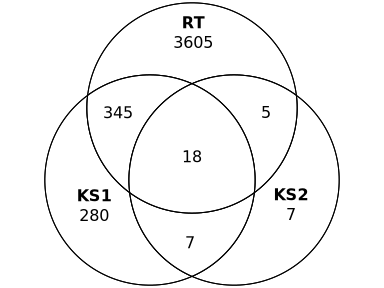
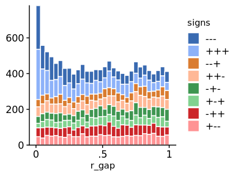
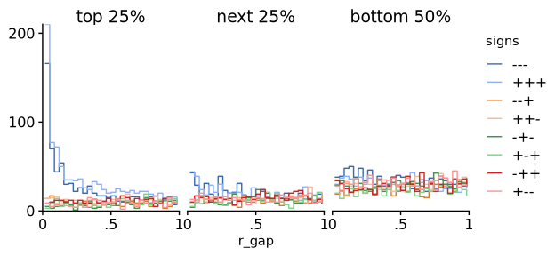
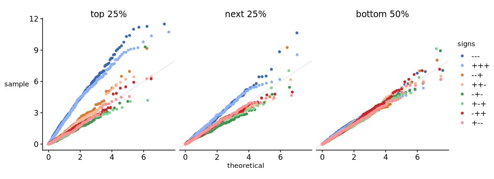

<!-- README.md is generated from README.Rmd. Please edit that file -->

# Rank-gap statistics for exploring high-dimensional overlap

<!-- badges: start -->
<!-- badges: end -->

Rank-gap statistics are easy-to-compute quantities for exploring
concordance among high-ranked items across multiple lists.

They were developed for analyzing “overlap” in genomics and high
throughput biology, and especially to give a simple complement to the
common “Venn diagrams of significant genes” approach (when errors are
independent across experiments or conditions). But they may be useful
more broadly.

### The big idea

In a genomics context we are often comparing ranked lists of genes
across multiple conditions or experiments. Rank-gap statistics are
defined for each gene $g$ by

$$
\text{rank-gap}_g = \left(
   \frac
       {\max(\text{ranks}_g) - \min(\text{ranks}_g) + 1}
       {\max(\text{ranks}_g) + 1}
\right)^{\text{number of conditions} - 1}
$$

…where “ranks” in the equation refers to the ranks of $g$ in each of the
conditions under consideration.

Why are these statistics useful?

- Rank-gap statistics have *p*-value-like properties: they are
  (approximately) uniformly distributed when gene ranks are independent,
  and smaller-than-uniform when gene ranks are closer than expected by
  chance across the conditions. So we can explore this “excess
  concordance” using familiar *p*-value techniques.

- These properties also hold within strata of $\max(\text{ranks}_g)$,
  which represents the maximum importance of a gene in *any* of the
  conditions. This lets us focus attention on excess concordance near
  the top of the lists.

## Example: overlapping gene expression changes in Mendelian Disorders of the Epigenetic Machinery

We illustrate the package using data from a comparison of (disease vs.
wild-type) gene expression differences in B cells of mice with three
related genetic diseases from the family of Mendelian Disorders of the
Epigenetic Machinery, or MDEMs. Our question is: how much “overlap” is
there in the gene expression changes across the conditions?

Importantly, diseased mice were compared with littermate controls, so we
expect technical errors across the three (disease vs. wild-type)
comparisons to be independent.

The data are from Luperchio et. al. (2021). The object `d_B_limma`
contains output from limma reanalyses of the raw read counts:

``` r
library(rankGap)
tibble::tibble(d_B_limma) |> head(3)
#> # A tibble: 3 × 25
#>   ensembl_id  logFC.KS1 AveExpr.KS1 t.KS1 P.Value.KS1 adj.P.Val.KS1 B.KS1 se.KS1
#>   <chr>           <dbl>       <dbl> <dbl>       <dbl>         <dbl> <dbl>  <dbl>
#> 1 ENSMUSG000…    0.0535        6.96 0.878       0.402         0.772 -6.92 0.0609
#> 2 ENSMUSG000…    0.221         1.35 1.08        0.306         0.711 -5.50 0.204 
#> 3 ENSMUSG000…    0.176         5.98 1.40        0.195         0.633 -6.25 0.125 
#> # ℹ 17 more variables: se_unshrunk.KS1 <dbl>, logFC.KS2 <dbl>,
#> #   AveExpr.KS2 <dbl>, t.KS2 <dbl>, P.Value.KS2 <dbl>, adj.P.Val.KS2 <dbl>,
#> #   B.KS2 <dbl>, se.KS2 <dbl>, se_unshrunk.KS2 <dbl>, logFC.RT <dbl>,
#> #   AveExpr.RT <dbl>, t.RT <dbl>, P.Value.RT <dbl>, adj.P.Val.RT <dbl>,
#> #   B.RT <dbl>, se.RT <dbl>, se_unshrunk.RT <dbl>
```

### Analysis with Venn diagrams of significant genes

We start with with the standard approach in computational biology of
computing Venn diagrams of (margianlly) statistically significant genes:

``` r
require(eulerr)
#> Loading required package: eulerr
require(qvalue)
#> Loading required package: qvalue
require(ggplot2)
#> Loading required package: ggplot2

# Matrix of detected DE indicators
m_de <-
  d_B_limma[c("P.Value.KS1", "P.Value.KS2", "P.Value.RT")] |>
  as.matrix() |>
  apply(2, \(p) qvalue::qvalue(p)$qvalues < .2)

colnames(m_de) <- c("KS1", "KS2", "RT")

venn(m_de) |>
  plot(quantities = TRUE, fills = FALSE)
```



There are only 18 genes detected as differentially expressed in all 3
conditions (using a threshold of *q* \< 0.2 estimated with the
Storey-Tibshirani method from `qvalue`). This method, called “vote
counting” in the meta-analysis literature, is known to be highly
conservative when there are many effects with weak signals.

### Analysis with rank-gap statistics

First, we visualize the distribution of rank-gap statistics in our data,
stratified by the signs of the estimated underlying effects. We first
create “signed scores” to use as input: in our case, signed log
*p*-values (it is misleading to use raw log fold-change estimates for
this purpose; see the thesis chapter for details):

``` r
d_B_limma <- transform(
  d_B_limma,
  signed_p_KS1 = -sign(logFC.KS1) * log(P.Value.KS1),
  signed_p_KS2 = -sign(logFC.KS2) * log(P.Value.KS2),
  signed_p_RT  = -sign(logFC.RT) * log(P.Value.RT)
)

with(d_B_limma, rank_gap_hist(signed_p_KS1, signed_p_KS2, signed_p_RT))
```



The spike near 0 in the distribution indicates greater-than-expected
concordance in the gene ranks across conditions. The histogram has been
stratified by the signs of the estimated log fold-changes, revealing
that the excess concordance is driven by genes with the same signs in
all 3 comparisons—i.e., genes either upregulated in all 3 MDEMs or
downregulated in all 3 MDEMs. The size of the spike is evidence that
there are of the order of hundreds of such genes.

We can focus on genes of interest by stratifying the analysis based on
the maximum rank statistic. Here we stratify using quartile bins (we use
“line histograms” to avoid overplotting):

``` r
with(
  d_B_limma,
  rank_gap_stephist(
    signed_p_KS1, signed_p_KS2, signed_p_RT,
    n_max_rank_bins = 4))
```



The signal of excess concordance is concentrated among the top 25% of
genes (ordered by maximum rank across the 3 conditions or, loosely,
“importance in at least one condition”).

Also the specific genes involved may be much more easily identified than
the Venn diagram analysis suggests. One way to do this is with a
stratified *Q-Q* plot:

``` r
with(d_B_limma,
  rank_gap_qq(
    signed_p_KS1, signed_p_KS2, signed_p_RT,
    n_max_rank_bins = 4))
```



## Package structure

- `rank_gap_hist`, `rank_gap_qq`, `rank_gap_stephist` – produce plots
  from signed input statistics
- `rank_gap_df` – produces a data frame (tibble) from signed input
  statistics containing quantities needed for the plots
- `rank_gap`, `signs_pm`, `concordances` – lower-level utility functions

## Installation and development

You can install the development version of `rankGap` from
[GitHub](https://github.com/) with:

``` r
# install.packages("pak")
pak::pak("l-d-s/rankGap")
```

The repo comes with a Nix development environment; with flakes enabled
you can try it out by cloning the repository and running `nix develop` or
alternatively just running `nix develop "github:l-d-s/rankGap"`. This
will drop you into an environment with R + prerequisites installed, along
with [`radian`](https://github.com/randy3k/radian) and workspace settings 
for the 
[`VSCode R extension`](https://github.com/REditorSupport/vscode-R).

Alternatively you can call the package using the standard `nixpkgs` R
infrastructure: for example

```bash
nix shell --impure --expr '
    with import (builtins.getFlake "github:nixos/nixpkgs") {};
    rWrapper.override {packages = [
        (builtins.getFlake "github:l-d-s/rankGap").packages.${system}.default
        # Put other R packages here
    ];}' \
    -c R
```
... will drop you into an R session with `rankGap` installed.

## Citation and references

This package is based on

``` bibtex
@thesis{diStefanoTamingInteractionsGenomics2024,
  title = {Taming Interactions in Genomics and Clinical Trials},
  author = {Di Stefano, Leon S},
  date = {2024-09-04},
  institution = {Johns Hopkins University},
  url = {https://jscholarship.library.jhu.edu/handle/1774.2/70173},
  urldate = {2025-01-08},
  abstract = {This dissertation develops statistical methods to address two challenges in contemporary biomedical research. The first is understanding shared mechanisms underlying related diseases using high- throughput molecular data, motivated by a study of gene expression changes in a group of rare genetic disorders called Mendelian Disorders of the Epigenetic Machinery or MDEMs (Luperchio et al., 2021). We develop a simple approach to assessing the degree of overlap among the disorders based on rescaled differences in ranks of each gene across conditions, which we call “rank-gap” statistics. Rank-gap statistics have p-value-like properties that highlight concordance among genes ranked highly in at least one condition, and we argue that the number of smaller than expected rank-gap statistics estimates a meaningful overlap metric in the limit of small measurement error. Rank-gap statistics also possess three- and higher-way analogues. We compare our proposal with other rank-based overlap methods in the literature, and evaluate a diverse group of related methods in a simulation study. Our approach provides a simple complement to the predominant practice in genomics of forming Venn diagrams of statistically significant genes. The second challenge is understanding how treatment effects vary among different types of patients using data from clinical trials. The standard approach—one-at-a-time subgroup or interaction analysis of candidate covariates—suffers from difficulties of inference and interpretation. We develop the proportional interaction model, a parsimonious extension of additive regression adjustment also considered by Follmann and Proschan (1999) and Kovalchik, Varadhan, and Weiss (2013) in which benefits and harms from treatment vary as a function of a “score” that also predicts outcomes in each treatment group. An asymptotic analysis enables us to assess the sample sizes required to detect proportional interactions in practice, and we propose a symmetrical re-parametrization of the model that allows for stable single-step inference. We re-analyze a clinical trial of treatments for schizophrenia using our approach, showing how proportional interactions can be incorporated into a traditional regression model-building framework.},
  langid = {american}
}
```

The data are from

- Luperchio TR, Boukas L, Zhang L, Pilarowski G, Jiang J, Kalinousky A,
  et al. *Leveraging the Mendelian disorders of the epigenetic machinery
  to systematically map functional epigenetic variation*. Dekker J,
  Barkai N, editors. eLife. 2021 Aug 31;10:e65884. doi:
  10.7554/eLife.65884
